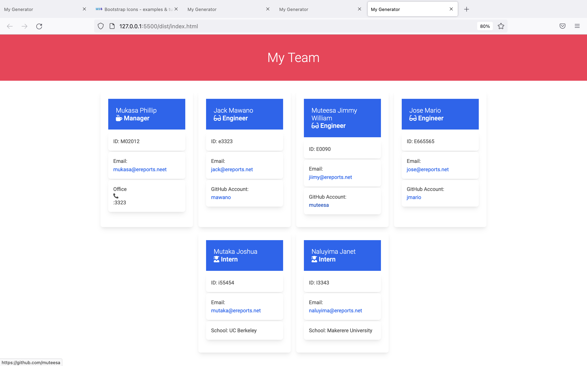

# Team-Profile-Generator   
  

    
    
    
       
  

  ## Description
  This application uses node.js to take in command line arguments to create an HTML file that displays members of a team and brief information about them. Using inquirer, the user first enters in the manager's name, id number, email and officer number and then can add an unlimited number of engineers and interns to the team.

  Team members are displayed in cards using bootstrap. Each team member has a unique aspect. The engineer's card contains a link to a Github account, while the intern has a line about their school.
  
 
  ## Table of Contents 
  * [Description](#description)
  * [Usage](#usage)
  * [License](#license)
  * [Screenshot](#screenshot)
  * [Walkthrough](#projectdemo)
  * [Testing](#testing)
  * [ProjectRepo](#projectrepo)
  * [Contribution](#contribution)
  
  ##  Usage
    node index.js

  ## License 
   
  This app is covered under MIT license.
  
  ## Screenshot
   
  ## Walkthrough
  
  ## Testing
    To test, download or clone the project and then type "node index.js" from the root directory.
  ## ProjectRepo 
  https://github.com/bwogi/Team-Profile-Generator
  ## Contributors
  Developed by Andrew Bwogi
